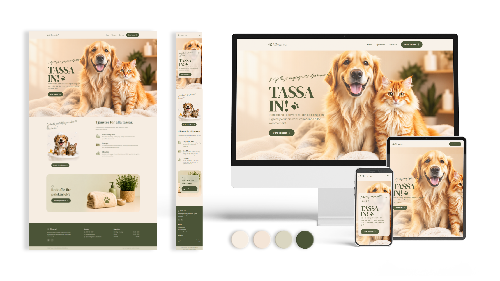

# Tassa in! – Djurvård



Bokningssystem för djurvård. Monorepo med React Vite (frontend) och ASP.NET Core 10 (backend API).

---

## Teknikstack

| Del | Teknik |
|-----|--------|
| Frontend | React 19 + Vite + TanStack Router |
| Formulär | React Hook Form + Zod |
| UI | shadcn/ui + Tailwind CSS v4 |
| Datum | date-fns + date-fns-tz |
| Backend | ASP.NET Core 10 Web API |
| Auth | ASP.NET Core Identity + JWT |
| ORM | Entity Framework Core 10 |
| Databas | PostgreSQL |
| DB-verktyg | pgAdmin 4 / DBeaver |

---

## Filstruktur

```
tassa-in/
│
├── MyApi/                          # C# ASP.NET Core API
│   ├── Controllers/
│   │   ├── AuthController.cs       # POST /api/auth/login → returnerar JWT
│   │   ├── BookingsController.cs   # GET /api/bookings/slots/{date}, POST /api/bookings
│   │   └── AdminController.cs      # GET/DELETE /api/admin/bookings (kräver Admin-roll)
│   ├── Data/
│   │   └── AppDbContext.cs         # EF Core DbContext med Identity + Bookings
│   ├── DTOs/
│   │   ├── AuthDtos.cs             # LoginDto, AuthResponseDto
│   │   └── BookingDtos.cs          # BookingCreateDto, BookingResponseDto, AvailableSlotDto
│   ├── Models/
│   │   ├── AppUser.cs              # Identity-användare (ärver IdentityUser)
│   │   └── Booking.cs              # Bokningsmodell med UTC-tider
│   ├── Services/
│   │   ├── BookingService.cs       # Slotgenerering, UTC-konvertering, bokningslogik
│   │   └── TokenService.cs         # JWT-generering
│   ├── appsettings.json            # Anslutningssträng + JWT-konfiguration (ej i git)
│   ├── appsettings.example.json    # Mall för appsettings (i git)
│   └── Program.cs                  # App-konfiguration: CORS, Identity, JWT, EF Core
│
├── src/                            # React Vite frontend
│   ├── components/
│   │   ├── ui/                     # shadcn/ui-komponenter (Button, Input, Select m.m.)
│   │   ├── navbar.tsx
│   │   └── footer.tsx
│   ├── lib/
│   │   ├── api.ts                  # Typesafe API-klient mot C# backend
│   │   └── schemas.ts              # Zod-scheman för bokning och inloggning
│   ├── routes/
│   │   ├── __root.tsx              # Root-layout (Navbar + Footer)
│   │   ├── index.tsx               # Startsida med snabbbokning
│   │   ├── boka.tsx                # Fullständigt bokningsformulär (RHF + Zod)
│   │   ├── tjanster.tsx            # Tjänstesida
│   │   ├── om-oss.tsx              # Om oss-sida
│   │   └── admin/
│   │       └── index.tsx           # Adminpanel: inloggning + bokningslista
│   ├── routeTree.gen.ts            # Auto-genererad av TanStack Router
│   └── router.tsx                  # Router-konfiguration
│
├── vite.config.ts                  # Vite + proxy /api → localhost:5207
└── package.json
```

---

## Öppettider & tidsluckor

| Dag | Öppet | Tidsluckor (starttider) |
|-----|-------|------------------------|
| Måndag–fredag | 10:00–18:00 | 10, 11, 12, 13, 14, 15, 16, 17 |
| Lördag | 10:00–14:00 | 10, 11, 12, 13 |
| Söndag | 11:00–15:00 | 11, 12, 13, 14 |

Varje tidslucka är 1 timme. Max 2 bokningar per lucka (2 anställda).

---

## API-endpoints

```
POST   /api/auth/login                  Logga in, returnerar JWT
GET    /api/bookings/slots/{date}       Lediga tider för ett datum (yyyy-MM-dd)
POST   /api/bookings                    Skapa en bokning
GET    /api/admin/bookings?date=        [Admin] Hämta bokningar, filtrera per datum
DELETE /api/admin/bookings/{id}         [Admin] Ta bort en bokning
```

---

## Komma igång

### Krav
- .NET 10 SDK
- Node.js 20+
- PostgreSQL

### 1. Konfigurera backend

```bash
cp MyApi/appsettings.example.json MyApi/appsettings.json
```

Redigera `MyApi/appsettings.json`:
```json
{
  "ConnectionStrings": {
    "DefaultConnection": "Host=localhost;Database=tassa_in;Username=postgres;Password=DITT_LÖSENORD"
  },
  "Jwt": {
    "Key": "din-hemliga-nyckel-minst-32-tecken-lång",
    "Issuer": "tassa-in-api",
    "Audience": "tassa-in-client"
  }
}
```

### 2. Kör EF Core-migrationer

```bash
cd MyApi
dotnet ef migrations add InitialCreate
dotnet ef database update
```

### 3. Skapa admin-användare

Lägg till detta tillfälligt i `Program.cs` precis före `app.Run()`, starta appen en gång, ta sedan bort koden:

```csharp
using (var scope = app.Services.CreateScope())
{
    var userManager = scope.ServiceProvider.GetRequiredService<UserManager<AppUser>>();
    var roleManager = scope.ServiceProvider.GetRequiredService<RoleManager<IdentityRole>>();
    await roleManager.CreateAsync(new IdentityRole("Admin"));
    var admin = new AppUser { UserName = "admin@tassain.se", Email = "admin@tassain.se", FullName = "Admin" };
    await userManager.CreateAsync(admin, "Admin1234");
    await userManager.AddToRoleAsync(admin, "Admin");
}
```

### 4. Starta

```bash
# Terminal 1 – C# API (port 5207)
cd MyApi
dotnet run

# Terminal 2 – React frontend (port 5173)
npm run dev
```

- App: `http://localhost:5173`
- Admin: `http://localhost:5173/admin/`

---

## Se databasen

**psql (kommandorad, ingår med PostgreSQL):**
```bash
psql -U postgres -d tassa_in
```
```sql
\dt                        -- lista alla tabeller
\d "Bookings"              -- visa kolumner i Bookings-tabellen
SELECT * FROM "Bookings";  -- se alla bokningar
\q                         -- avsluta
```

**Grafiskt gränssnitt (välj ett):**
- [pgAdmin 4](https://www.pgadmin.org/download/) — webbgränssnitt, liknar Prisma Studio
- [DBeaver](https://dbeaver.io/download/) — desktopapp, gratis

Anslut med samma uppgifter som i `appsettings.json`.

---

## Tidszon

Alla tider lagras i UTC i databasen. Konvertering till/från svensk tid (`Europe/Stockholm`, CET/CEST) hanteras av `BookingService.cs` via paketet `TimeZoneConverter`. Sommartid och vintertid hanteras automatiskt — ingen manuell offset behövs.
